# ECS Store Backend (Portfolio Edition)

A feature-rich **e‑commerce backend** built with **Django + DRF** that goes beyond basic CRUD: auctions, brand management with points/ranks, delivery workflow with proof of delivery, reviews/ratings, wallet with escrow/holds, notifications, returns/refunds, and robust role-based permissions.

---

## ✨ Key Features

* **Auth & Roles**: Custom `User` model with roles (`user`, `seller`, `delivery`, `admin`, `superadmin`) via JWT.
* **Catalog**: Categories (parent/child), products with images, discounts (standalone + sale events), search & filters, brand support with approval flow.
* **Brands + Points/Ranks**: Sellers unlock brand creation/usage after reaching point thresholds; admin reviews/approves.
* **Cart & Orders**: Stock validation, atomic checkout with wallet escrow (held balance), multi-seller settlement.
* **Wallet**: Balance, held\_balance, transactions (`ESCROW_HOLD`, `ESCROW_RELEASE`, `PAYMENT`, `REFUND`).
* **Auctions**: Admin-approved auctions, bidding with automatic wallet holds, anti‑sniping window, manual close path that creates an order for the winner.
* **Delivery App**: Delivery users can claim up to 5 active orders, advance statuses (PROCESSING → SHIPPED → DELIVERED), see buyer location, and complete with **proof of delivery** (PIN/QR).
* **Returns/Refunds**: Multi-status inspection flow; penalties can deduct seller points; restocking by condition.
* **Reviews & Ratings**: Verified purchase reviews; 1 review per product per order; aggregates on product.
* **Notifications**: Systemwide events (orders, returns, brands, auctions, delivery) using a flexible model with `content_object` + `extra_data`.

---

## 🧩 Architecture Overview


---

## 🔁 Core Workflows (Mermaid)

### Order Checkout & Completion

```mermaid
sequenceDiagram
  participant U as Buyer
  participant C as Cart
  participant W as Wallet
  participant O as Orders
  participant P as Products
  participant N as Notifications

  U->>C: Add items
  U->>O: POST /orders/checkout
  O->>P: Validate stock (select_for_update)
  O->>W: Hold total (escrow)
  O-->>U: Order CREATED
  N-->>U: order_created

  Note over Delivery: Delivery claims → PROCESSING → SHIPPED → DELIVERED

  U->>O: After 3 days of delivery → complete_order
  O->>W: Release hold; pay sellers
  N-->>U: order_completed
  N-->>S: seller_payment
```

### Auction → Order

```mermaid
sequenceDiagram
  participant S as Seller
  participant A as Auction
  participant B as Bidders
  participant W as Wallet
  participant O as Orders
  participant N as Notifications

  S->>A: Create & submit auction
  Admin->>A: Approve (scheduled)
  B->>A: Place bid (min increment)
  A->>W: Move bid top-up to held
  A->>B: Outbid → release previous hold
  Admin->>A: Close auction (manual)
  A->>O: Create order for winner
  N-->>Winner: auction_won
  N-->>Seller: auction_sold
```



### Delivery with Proof


---

## 📦 Tech Stack

* **Python 3.11+, Django 4.2, DRF**
* **SQLite** (dev), compatible with Postgres/MySQL
* **JWT auth**
* **Optional**: Celery + Redis (for scheduling). In this version, auction activation/closure supports **manual admin endpoints** to avoid Redis in dev.

---

## 🚀 Getting Started

### 1) Clone & Install

```bash
python -m venv .venv && source .venv/bin/activate  # Windows: .venv\Scripts\activate
pip install -r requirements.txt
cp .env.example .env  # set SECRET_KEY, EMAIL, etc.
```

### 2) Migrate & Create Superuser

```bash
python manage.py migrate
python manage.py createsuperuser
```

### 3) Run Server

```bash
python manage.py runserver
```

### 4) Seed (Optional)

Provide fixtures or a custom command (example):

```bash
python manage.py loaddata demo_users.json demo_products.json
```

---

## 🔐 Roles

* **Buyer (user)**: browse, cart, orders, returns, reviews.
* **Seller**: create products, manage discounts, auctions, brands (subject to points/approval).
* **Delivery**: claim/advance orders, max 5 active, proof of delivery.
* **Admin/Superadmin**: approve products/brands/auctions, settle auctions, view all.

---

## 🧪 Testing the Major Flows (Postman-friendly)

### Brands

* `POST /api/product/brands/create/` (seller) → pending
* `GET /api/product/brands/admin/pending/` (admin)
* `POST /api/product/brands/admin/{id}/approve/` or `/reject/`
* Assign brand on product creation or via `PATCH /api/product/products/{product_id}/assign-brand/`

### Checkout

* `POST /api/orders/checkout/` → creates order, holds escrow
* Delivery picks & advances: see Delivery section below
* After 3 days from delivered: `POST /api/orders/{id}/complete/` → releases escrow, pays sellers

### Auctions

* `POST /api/auctions/create/` (seller)
* `POST /api/auctions/admin/{id}/review/` approve/reject
* `POST /api/auctions/{id}/bid/` (buyer)
* `POST /api/auctions/admin/auctions/{id}/close/` (admin) → creates order for winner

### Delivery

* `GET /api/delivery/orders/available/` (delivery)
* `POST /api/delivery/orders/{id}/claim/`
* `POST /api/delivery/orders/{id}/advance/` (PROCESSING→SHIPPED → auto generates proof & notifies buyer) → then DELIVERED
* **Optional proof endpoints**

  * `GET /api/orders/{id}/proof/` (buyer)
  * `POST /api/orders/{id}/proof/confirm/` (delivery; submit PIN/QR token)

### Returns

* Buyer `POST /api/returns/` → request
* Delivery/admin: inspect via `POST /api/returns/{id}/process-statuses/` (record only)
* Admin `PATCH /api/returns/{id}/update/` approve/reject → triggers refund/penalty/stock

### Reviews

* `POST /api/reviews/` (create) — requires delivered/completed order
* `PATCH /api/reviews/{id}/` (edit)
* `DELETE /api/reviews/{id}/`

---

## 🗺️ Buyer Location

* `Profile` stores `location_lat`, `location_lng`, `location_address`.
* Checkout enforces saved location.
* Delivery can view buyer location for assigned orders.

---

## 🧮 Ratings Aggregation

* Product exposes `avg_rating` and `ratings_count` via annotated queryset or cached fields updated on review create/update/delete.

---

## 🔔 Notifications

* Single `Notification` model with `content_object` (Generic FK) + optional `extra_data`.
* Serializer safely hides sensitive user fields.
* Examples: `order_created`, `order_shipped`, `auction_outbid`, `brand_approved`, etc.

---

## ⚖️ Concurrency & Data Integrity

* Heavy use of `transaction.atomic()` and `select_for_update()` for stock, wallet holds, auction bids, order completion.
* Idempotent patterns where possible.

---

## 🧰 Project Structure (major apps)

```
accounts/      # auth, roles, JWT
products/      # categories, products, images, sales, brands
orders/        # orders, checkout, completion, cancel, refund
wallet/        # wallets, transactions
auctions/      # auctions, bids, services, admin close flow
delivery/      # delivery claim/advance, proof of delivery
returns/       # returns workflow and penalties
reviews/       # reviews & ratings (verified purchase)
notifications/ # systemwide notifications
```

---

## 📘 API Docs / Swagger

You can enable **drf-yasg** and expose Swagger/Redoc, e.g. `/swagger/` and `/redoc/` (already included in `INSTALLED_APPS`).

---

## 🧪 Tests (suggested)

* Unit tests for wallet transactions/escrow math.
* Integration tests: checkout, delivery flow, returns approval, auction close → order creation.
* Permissions tests for role-restricted endpoints.

---

## 🔧 Local Scheduling (Optional)

For production‑grade automation (e.g., auctions auto-activate/close, auto-complete orders), wire **Celery + Redis**. On Windows, Redis-compatible options include **Memurai**. This repo supports manual admin endpoints for the same transitions to simplify local dev.

---

## 📄 License

MIT (or your choice).

---

## 🙌 Credits

Built by Osama — backend engineering, domain modeling, and end-to-end workflows.
